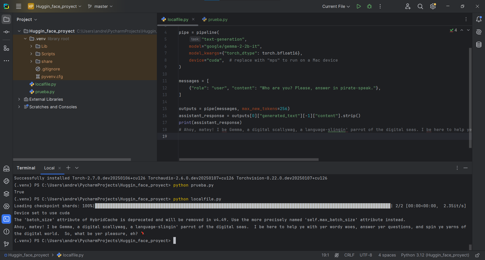

# hugginfaceLocal-Api
Uso de la Api para modelos de hugginface, tambien la iteracion de modelos en local
#Implementacion en local
Primero comenzaremos descargando la libreria de Transformers:
```bash
pip install -U transformers
```
Luego descargaremos la libreria de torch:
```bash
pip install torch
```
Despues crearemos el script utilizando la funcion pipeline que es para canalizar el modelo de modo que que prediga la siguiente cadena de texto del usuario, es el encargado de procesar el texto a numerico y luego mostrarlo a el usuario de una forma legible.
```bash
import torch
from transformers import pipeline

pipe = pipeline(
    "text-generation",
    model="google/gemma-2-2b-it",
    model_kwargs={"torch_dtype": torch.bfloat16},
    device="cuda",  # replace with "mps" to run on a Mac device
)

messages = [
    {"role": "user", "content": "Who are you? Please, answer in pirate-speak."},
]

outputs = pipe(messages, max_new_tokens=256)
assistant_response = outputs[0]["generated_text"][-1]["content"].strip()
print(assistant_response)
```
# Requerimientos
-Una version Torch de +2.x
-Tiene que ser compatible con CUDA preferiblemente para su facil ejecucion, osea usando la GPU de Nvidia.
-Capacidad para almacenar 5GB de modelo.
# Ejemplos de Ejecucion:

